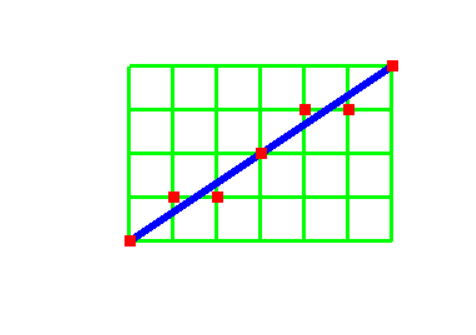

# 直线绘制算法 #

*本文介绍内容归属计算机图形学范畴，基于二维平面直角坐标系绘制*

---

## 为何研究直线绘制算法？ ##

现实世界绘制直线(段)只靠直尺和笔，而计算机显示图形需点亮屏幕像素点——绘点成线(段)

如同一连串英文句点绘制而成的分割线，效果如下（*离散化的近似表现*，假使放大页面会出现明显间隙）

...............................................................................

可惜直线不只是水平线，还包括斜线吖！（QAQ）

为此，图形学者致力寻找高效绘点算法 (\掌声)。我们将讨论以下三种直线绘制算法：

1. DDA算法
    * 算法思想**简单**
    * 直线平滑性差，效率较高
2. 逐点比较算法（亦称插补法）
    * **工业常用**算法
    * 直线平滑性好，效率较低
3. Breseham算法
    * **高效**
    * 兼并DDA算法与插补法思想

## DDA（DIgital differential analyzer）算法 ##

聪明的数学家早将直线用数学公式表示出来 **y = k · x + b**

求解两个未知量 `k、b` 我们只需y知晓两组点数据即可（两点绘制一条直线），那么我们就用线段的起点和终点代入公式吧。（^_^）

`起点p0(0, 0) 终点p6(6, 4) -> k = 1.5，b = 0`。观察发现当 `x2 = x1 + 1` 时，`y2 = y1 + k`

计算机像素单位长度为1（即像素点数据均为整数），我们凑巧将 y2 取整成 y2' 即得需点亮像素点位置 `(x2, y2')`

依此类推，`x3 = x2 + 1，y3 = y2 + k，y3' = 取整y3` ……

大功告成？哦不！我们还能优化一下效率

* 当直线斜率 `k < 1` 时，我们以x为主，采用 `x2 = x1 + 1` 的步进方式，加快水平方向延伸速度

* 当直线斜率 `k > 1` 时，我们以y为主，采用 `y2 = y1 + 1` 的步进方式，加快垂直方向延伸速度

***取整步骤需要对小数四舍五入，对效率略有影响***

最终代码如下

```c
/**
	使用openGL的glut库
	#include <gl\glut.h>
	#include <math.h>
	x1 = 0，y1 = 0
	x2 = 6，y2 = 4
*/
void drawLineDDA(GLint x1, GLint y1, GLint x2, GLint y2)
{
	glColor3f(1.0f, 0.0f, 0.0f);	//置颜色为红
	int dx = x2 - x1;
	int dy = y2 - y1;
	dx = abs(dx);
	dy = abs(dy);
	int step = dx > dy ? dx : dy;	//判断k与1的关系，若dx大，水平方向延伸为主；若dy大，垂直方向延伸为主
	double xin = dx / step;	//x轴步长
	double yin = dy / (double)step;	//y轴步长
	double x = x1;
	double y = y1;
	glBegin(GL_POINTS);
	for (int i = 0; i <= step; i++)
	{
		glVertex2f(x / 10.0, int(y + 0.5) / 10.0);	//int(y + 0.5)将y值四舍五入，绘于标准化坐标系，故除以10.0
		x = x + xin;
		y = y + yin;
	}
	glEnd();
}
```

绘制结果如图（补上绿色网格，绿线交点为像素点，白块代表像素空隙（放大效果））



## 逐点比较算法（插补法） ##

此算法以像素点为主，**第一象限**前提下考虑**右方向**和**上方向**像素点与直线位置，二选一点亮

同样取 `起点p0(0, 0) 终点pn(6, 4)` 代入公式 **y = k · x + b** 得 ` k = 1.5，b = 0`

当像素点 `p` 在直线上方时 `yp / xp > (y6 - y0) / (x6 - x0)`，即 `yp * (x6 - x0) - (y6 - y0) * xp > 0`

当像素点 `p` 在直线中时 `yp / xp = (y6 - y0) / (x6 - x0)`，即 `yp * (x6 - x0) - (y6 - y0) * xp = 0`

当像素点 `p` 在直线下方时 `yp / xp < (y6 - y0) / (x6 - x0)`，即 `yp * (x6 - x0) - (y6 - y0) * xp < 0`

把 `yp * (x6 - x0) - (y6 - y0) * xp` 记为 `F` 则 `F = yp * (x6 - x0) - (y6 - y0) * xp` 即为偏差公式，且起点偏差应为 `F0 = 0`

1. 当 `F > 0` 时，`x2 = x1 + 1`（即点亮右方像素点）

2. 当 `F = 0` 时，`x2 = x1 + 1`（即点亮右方像素点）或 `y2 = y1 + 1`（即点亮上方像素点）

3. 当 `F < 0` 时，`y2 = y1 + 1`（即点亮上方像素点）

但逐次求解含有乘法的偏差公式严重影响效率~~有木有啊~~，简化为下式（当 `F = 0` 时取 `x2 = x1 + 1`）

* 当 `F1 >= 0` 时 `F2 = yp * (x6 - x0) - (y6 - y0) * (xp + 1) = F1 - (y6 - y0)`

* 当 `F1 < 0` 时 `F2 = (yp + 1) * (x6 - x0) - (y6 - y0) * xp = F1 + (x6 - x0)`

***因为可能点亮上方像素点，意味同一y值下不只点亮一点像素，故效率较低***

同理可得第二象限、第三象限、第四象限求法，请读者自行计算，不再赘述（偷个懒 \滑稽）

最终代码如下

```c

```

## Bresenham算法 ##

此算法基于DDA算法进行逐点比较改进而来，同逐点比较法以像素点为主，考虑**右方向**和**右上方向**像素点与直线位置，二选一点亮

无耻地盗个图


同样取 `起点p0(0, 0) 终点p6(6, 4)` 代入公式 **y = k · x + b** 得 ` k = 1.5，b = 0`

存在规律 `y2 = y1 + k`，若 `y2` 偏上则点亮右上方像素点，若 `y2` 偏下则点亮右方像素点，即比较交点 `y2` 与像素间距中点位置

记 `d = (y2 - y0) / (x2 - x0) - └ (y2 - y0) / (x2 - x0) ┘` ，（`└x┘` 表示取下整，如 `└1.2┘ = 1`；减去 `└ (y2 - y0) / (x2 - x0) ┘` 为保证 `d ∈ [0, 1]`）则

当 `d > 0.5` 时，`x2 = x1 + 1，y2 = y1 + 1`（即点亮右上方像素点）

当 `d = 0.5` 时，`x2 = x1 + 1，y2 = y1 + 1`（即点亮右上方像素点）或 `x2 = x2 + 1`（即点亮右方像素点）

当 `d < 0.5` 时，`x2 = x1 + 1`（即点亮右方像素点）

进一步设 `e = d - 0.5` 则

当 `e > 0` 时，`x2 = x1 + 1，y2 = y1 + 1`（即点亮右上方像素点）

当 `e = 0` 时，`x2 = x1 + 1，y2 = y1 + 1`（即点亮右上方像素点）或 `x2 = x2 + 1`（即点亮右方像素点）

当 `e < 0` 时，`x2 = x1 + 1`（即点亮右方像素点）

至此算法演变为判断 `e` 的正负号，既然如此我们可将算式转为整数加减形式提高效率

**记 `G = e * 2 * (x2 - x0) = (2d - 1) * (x2 - x0) = 2(y2 - y0) - (x2 - x0)` 则**

**当 `G > 0` 时，`x2 = x1 + 1，y2 = y1 + 1`（即点亮右上方像素点）**

**当 `G = 0` 时，`x2 = x1 + 1，y2 = y1 + 1`（即点亮右上方像素点）或 `x2 = x2 + 1`（即点亮右方像素点）**

**当 `G < 0` 时，`x2 = x1 + 1`（即点亮右方像素点）**

大可利用编程语言特性，使 ` d = d + k - └ d + k ┘` 则（当 `d = 0.5` 时取 `x2 = x1 + 1`）

且 `dx = (x2 - x1) = 1，dy = (y2 - y1) = k` 为固定值 `G` 初始值为 `G0 = -(x1 - x0) = -dx`

当 `G > 0` 时，`x2 = x1 + 1，y2 = y1 + 1，G = G + 2 * (y2 - y1) - 2 * (x2 - x1) = G + 2 * dy - 2 * dx`（即点亮右上方像素点）

当 `G = 0` 时，`x2 = x1 + 1，G = G - 2 * (x2 - x1) = G - 2 * dx`（即点亮右方像素点）

当 `G < 0` 时，`x2 = x1 + 1，G = G - 2 * (x2 - x1) = G - 2 * dx`（即点亮右方像素点）

***同一y值下仅点亮一点像素，且计算过程均为整数加减，适用各象限无需分类，高效快捷***

最终代码如下
```c

```

---

## 参考资料 ##

*[DDA算法_百度百科](http://baike.baidu.com/item/DDA%E7%AE%97%E6%B3%95)*

*[逐点比较法直线插补](https://wenku.baidu.com/view/7df948146c175f0e7cd1377f.html)*

*[直线段扫描算法 -- Bresenham算法](http://blog.sina.com.cn/s/blog_73428e9a01016gnp.html)*

*[Bresenham直线算法与画圆算法](http://www.360doc.com/content/13/1220/09/11400509_338596444.shtml)*
